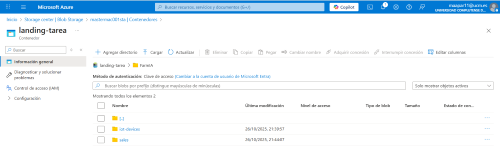
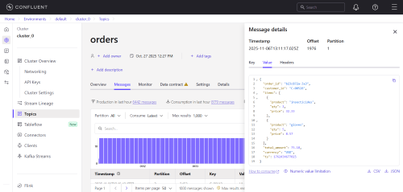
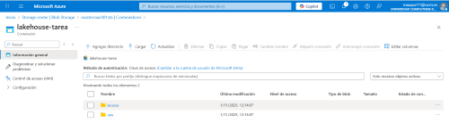
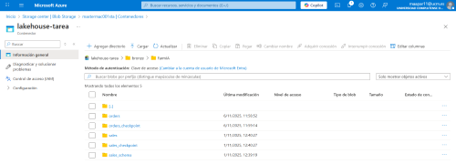

# TAREA DISEÑO DE INGESTAS Y LAGOS DE DATOS 
**María Aparicio Castellanos**

##REQUISITOS PREVIOS
Primero nos aseguramos de tener:
- Dos contenedores en ADLS:
    - landing-tarea
    - lakehouse-tarea con carpetas /raw y /bronze
- El topic Kafka en COnfluent Cloud (*orders*)
- El archivo client_properties con las credenciales indicadas:
```
# Required connection configs for Kafka producer, consumer, and admin
bootstrap.servers=pkc-57q33g.westeurope.azure.confluent.cloud:9092
security.protocol=SASL_SSL
sasl.mechanisms=PLAIN
sasl.username=ACFJ75Q3RBFDZGWT
sasl.password=cfltCa//xme19Z5u6Lv3uw2DzQMdScFJbapncL8Z+KPYfynAvufbFAxkbshXeXYQ

# Best practice for higher availability in librdkafka clients prior to 1.7
session.timeout.ms=45000

client.id=ccloud-python-client-55368043-eb0b-4c22-b5f4-e8888ffc30ff
```
Mi recomendación para la ejecución completa es ejecutar en una celda el motor:

`dbutils.notebook.run("./motor_ingesta", timeout_seconds=0)`

Para ejecutar el .whl:\
`pip install dist/my_ingesta-1.0.0-py3-none-any.whl`

## PARTE 1: DISEÑO DE LA ARQUITECTURA DEL DATA LAKEHOUSE
La arquitectura elegida es la siguiente:


### Sources
Aquí tenemos las fuentes de datos indicadas en la tarea:
- **Sensores IoT:** envían datos continuos sobre temperatura, humedad, etc. (Streaming)
- **Eventos de clientes en tiempo real:** clics, logins, etc. del cliente en la app/web. (Streaming)
- **Datos de ventas online:** ventas de clientes en la web/app en tiempo real. (Streaming) 
- **Resgistros de inventario:** son ficheros periódicos. (Batch)
- **Datos de proovedores y logística:** son ficheros externos con información sobre envíos y tiempos de entrega. (Batch)
- **Información meteorológica externa:** Datasets externos para predecir cosechas y optimizar la distribución. (Batch)

### Ingest
La ingesta la dividiremos en dos vías:
#### Streaming
Con **Event Hub** recibiremos flujos en tiempo real. Desde aquí, Databricks consume los mensajes, los limpia y los deja en **Delta Lake - Bronze**.\
Flujo de datos Streaming: Kafka → Event Hub → Databricks

#### Batch
**Azure Data Factory** copia periódicamente los datos batch desde el origen hasta el **Data Lake**. Después, Databricks procesa los ficheros y los sube a la siguiente capa (Bronze).\
Flujo de datos Batch: ADF → Databricks → Landing (Bronze)

### Procesamiento y preparación 
En esta parte tenemos el corazón del Lakehouse. Aquí se prepararán los datos para ML y BI.\
**Kafka** nos servirá para mantener streams activos.
Con **Databricks** y **Delta Live Tables**, prepararemos los datos limpiando, normalizando y enriqueciendo.\
Implementamos el patrón **Medallion**:
- **Capa Bronze:** contiene los datos crudos (raw) y los metadatos. 
- **Capa Silver**: aquí encontraremos los datos curados, es decir, los datos que limpiaremos. 
- **Capa Gold**: contiene los datos analíticos, listos para ser analizados o agregados. 
- **Capa Platinum**: aquí encontraremos datasets específicos de *Machine Learning*, datos que podremos entrenar.\

**Delta Live Tables** también nos permite definir los pipelines Silver/Gold.

###Serving 
Esta capa es la capa de consumo para todos los productos. 
- **Power BI** y **Tableau** conectan directamente con las capas Gold o Platinum del Lakehouse para visualizar los datos.
- **MLflow** permite entrenar y gesionar modelos de Machine Learning principalmente con la capa Gold.

##PARTE 2: IMPLEMENTACIÓN DEL MOTOR DE INGESTA
Para la ejecución del motor de ingesta, será suficiente con ejecutar el notebook *motor_ingesta* dentro de la carpeta notebooks. Esto ejecutará tanto la ingesta batch como la ingesta streaming.

Tras la ejecución de los notebooks, los resultados obtenidos los podemos ver en:
1. El contenedor de Azure, tendremos en la capa landing las carpetas con los ficheros *iot-devices* y *sales* de la ingesta batch.\


2. En Confluent, podemos ver las ventas de la ingesta streaming en el topic *orders*.\


3. Tras ejecutar los notebooks, tenemos en el contenedor de Azure el lakehouse de la tarea con las capas raw y bronze correspondientes a la tarea.\
\



